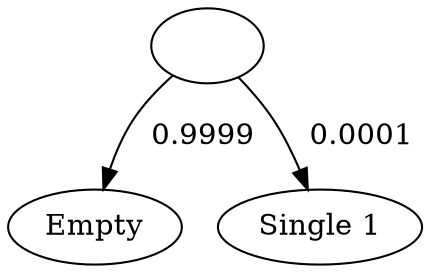

<!-- <script type="text/javascript" async -->
<!--   src="https://cdnjs.cloudflare.com/ajax/libs/mathjax/2.7.7/MathJax.js?config=TeX-MML-AM_CHTML"> -->
<!-- </script> -->
<!-- <script type="text/x-mathjax-config"> -->
<!--   MathJax.Hub.Config({ -->
<!--     tex2jax: { -->
<!--       inlineMath: [ ['$','$'], ["\\(","\\)"] ], -->
<!--       processEscapes: true -->
<!--     } -->
<!--   }); -->
<!-- </script> -->

Here's a classic kind of probability word problem:

> There's a 1% chance of catching a deadly illness and you test positive.
> The test is correct 99% of the time. What are the odds that you're actually sick?

Humans can solve problems like these by
translating them into probability theory
and performing the proper calculations.
<!-- In this case, we can use Bayes' rule: -->
<!-- $$ -->
<!-- \begin{aligned}\mathbf{P}(\textrm{sick}\mid\textrm{positive}) -->
<!-- &= \frac{\mathbf{P}(\textrm{positive}\mid\textrm{sick})\mathbf{P}(\textrm{sick})} -->
<!--   {\mathbf{P}(\textrm{positive})}\\ -->
<!-- &= \frac{\mathbf{P}(\textrm{positive}\mid\textrm{sick})\mathbf{P}(\textrm{sick})} -->
<!--   {\mathbf{P}(\textrm{positive}\mid\textrm{sick})\mathbf{P}(\textrm{sick}) -->
<!--   +\mathbf{P}(\textrm{positive}\mid\textrm{healthy})\mathbf{P}(\textrm{healthy})}\\ -->
<!-- &= \frac{(0.99)(0.01)}{(0.99)(0.01) + (0.01)(0.99)}\\ -->
<!-- &= \frac12 -->
<!-- \end{aligned} -->
<!-- $$ -->
But probability is often counterintuitive, and calculations are easy to get wrong.
So, why not have computers do the math for us?

Here's an OCaml program that simulates the situation described above:
```ocaml
let sim () =
  (* Before getting tested, there's a 1% chance I'm sick. *)
  let sick : bool = Random.float 1.0 <= 0.01 in
  (* Simulate a test result. *)
  let accuracy = 0.99 in
  let test_result =
    if sick
    (* If I'm sick, then there's a 99% chance the test comes back positive. *)
    then Random.float 1.0 <= accuracy
    (* If I'm healthy, then there's a 99% chance the test comes back negative. *)
    else Random.float 1.0 <= 1.0 -. accuracy
  in
  (* We only care about the situation where the test comes back positive. *)
  assert test_result;
  sick
```

If I run this program, there are three possible outcomes:

- It produces the output `true`.
- It produces the output `false`.
- It fails the assertion on the second-to-last line.

Each outcome corresponds to an outcome of our hypothetical scenario:

- Output `true` corresponds to getting a true positive test result.
- Output `false` corresponds to getting a false positive test result.
- Assertion failure corresponds to getting a negative test result.

So, the probability that I'm sick given a positive test result
is just the probability that `sim ()` returns `true` given that
it doesn't fail. I can estimate this probability
by running `sim ()` a large number of times, discarding all the failed runs,
and computing the fraction of runs that returned `true`.

This is called 
[probabilistic programming](https://en.wikipedia.org/wiki/Probabilistic_programming).
In regular programming, you write a program and then run it to get a result.
The program you write could use (pseudo)randomness in it (e.g. simulated dice rolls),
but at the end of the run you still only get a single value.
In probabilistic programming, you write a program and then run an _inferencer_
that computes a distribution over output values.
This inferencer can then serve as a substitute for having to do
error-prone probability calculations by hand.

You can find a lot of papers online about writing efficient inferencers. 
Before reading them, I wanted to roll my own inferencers and try them out on some 
simple problems. 
This post describes how they work.

## Modelling random computations

The following GADT encodes the abstract syntax of probabilistic programs:

```ocaml
type 'a rand
  = Pure : 'a -> 'a rand
  | Fail : 'a rand
  | Coin : float -> bool rand
  | Let : 'a rand * ('a -> 'b rand) -> 'b rand
```

A value of type `'a rand` represents a probabilistic program that
produces a value of type `'a` if successful.
Each constructor of `rand` represents a basic probabilistic
programming construct:

- The program `Pure x` always succeeds with value `x`.
- The program `Fail` always fails.
- The program `Coin p` always succeeds; 
  it yields `true` with probability \\(p\\) and `false` with
  probability \\(1-p\\).
- The program `Let (e1, fun x -> e2)` is a "probabilistic let binding."
  It first runs `e1` and binds the result to `x`; then, it runs `e2` with `x` in scope.

We can write an interpreter for probabilistic computations
by translating the above explanations of each of `rand`'s constructors 
into OCaml code:

```ocaml
exception Failure
let rec run : type a. a rand -> a = function
  | Pure x -> x
  | Fail -> raise Failure
  | Coin p -> Random.float 1.0 <= p
  | Let (m, k) -> run (k (run m))
```

We'll also define a useful combinator, `guard`,
for making assertions, and
define the notation `let* x = e1 in e2` to be
`Let (e1, fun x -> e2)` using
OCaml's [binding operators](https://caml.inria.fr/pub/docs/manual-ocaml/bindingops.html):

```ocaml
let guard b m = if b then m else Fail
let ( let* ) m k = Let (m, k)
```

These allow us to write probabilistic programs in
syntax that looks a lot like regular OCaml.
For example, here's what the program from the introduction 
looks like in this representation:

```ocaml
let illness : bool rand =
  let* sick = Coin 0.01 in
  let accuracy = 0.99 in
  let* test_result =
    if sick
    then Coin accuracy
    else Coin (1.0 -. accuracy)
  in
  guard test_result @@
  Pure sick
```

Our inferencers will analyze probabilistic programs and
produce distributions of output values, represented by
lists of value-probability pairs:

```ocaml
type 'a dist = ('a * float) list
type 'a inferencer = 'a rand -> 'a dist
```

With all these definitions in hand, we're now ready to write some inferencers.

## Monte Carlo simulation

The most basic inferencer just runs the given probabilistic program a bunch of 
times and uses the results of successful runs to estimate the distribution of 
output values:

```ocaml
module H = Hashtbl
let monte_carlo (type a) (samples : int) (m : a rand) : a dist =
  let rec run' () = try run m with Failure -> run' () in
  let d = H.create samples in
  for _ = 1 to samples do
    let x = run' () in
    H.replace d x (1 + try H.find d x with Not_found -> 0)
  done;
  let prob_of count = float_of_int count /. float_of_int samples in
  List.sort compare (H.fold (fun x c xs -> (x, prob_of c) :: xs) d [])
```

Running `monte_carlo` with 10000 samples
on the example in the introduction yields the following distribution:
```ocaml
Value   Probability     Plot
false   0.502600        █████████████████████████
true    0.497400        ████████████████████████▌
```
(Indeed, the probability of being sick given a positive test result
is 50%, by Bayes' rule.)

This inferencer isn't great: even for simple probabilistic programs,
it takes a large number of samples to converge on the true
distribution of output values.
It also has a major weakness: because the sampling function has to
keep retrying `m` until it successfully produces a result value,
it takes forever to collect a sufficiently large number of samples
if `m` doesn't succeed very often.

Here's an example: the following program
flips three fair coins and computes the number of heads:
```ocaml
let flip3 : int rand =
  let ind p = if p then 1 else 0 in
  let* c1 = Coin 0.5 in
  let* c2 = Coin 0.5 in
  let* c3 = Coin 0.5 in
  Pure (ind c1 + ind c2 + ind c3)
```
Running `monte_carlo` on `flip3` with 10000 samples
quickly yields a reasonable-looking distribution:
```ocaml
Value   Probability     Plot
0       0.128100        ██████
1       0.370200        ██████████████████▌
2       0.374800        ██████████████████▌
3       0.126900        ██████
```
(For reference, the true probabilities are 1/8, 3/8, 3/8, and 1/8 respectively.)

Now, here's a program that fails 99.99% of the time,
but behaves just like `flip3` when it succeeds:
```ocaml
let flip3' =
  let* b = coin 0.0001 in
  guard b flip3
```
This program has the exact same distribution of output values as `flip3`,
but it'll take 10000 times as long on average for `monte_carlo` to figure 
that out.

## Exhaustive enumeration

An alternative approach is to run through every possible code path
of the program to analyze. We can do this by interpreting
probabilistic programs as
[decision trees](https://en.wikipedia.org/wiki/Tree_diagram_(probability_theory)),
with output values or failures at the leaves, and
probabilistic choices at internal nodes:

```ocaml
type 'a tree
  = Single of 'a 
  | Empty 
  | Branch of float * 'a tree * 'a tree
```

- `Single x` is a leaf with one value, representing a successful run with output `x`.
- `Empty` is a leaf with no values, representing a failed run.
- `Branch (p, l, r)` is a tree representing a random choice between subtrees `l` and `r`.
    Subtree `l` is chosen with probability \\(p\\), and `r` with probability
    \\(1-p\\).

    Though branch only stores one `float`, we'll draw
    `Branch (p, l, r)` as a node with two outgoing edges, each labelled by
    a probability:
    ```graphviz
    digraph {
      branch [label = ""];
      l [shape = plaintext];
      r [shape = plaintext];
      branch -> l [label = "  p"];
      branch -> r [label = "  1 - p"];
    }
    ```

It's easy to convert programs into decision trees:

```ocaml
let rec treeify : type a. a rand -> a tree = function
  (* Pure x always succeeds with x, and Fail always fails *)
  | Pure x -> Single x
  | Fail -> Empty
  (* Coin p is a random choice between true and false *)
  | Coin p -> Branch (p, Single true, Single false)
  (* To interpret (Let (m, k)), apply (treeify . k) to each (Single x) in (treeify m) *)
  | Let (m, k) ->
    let rec go = function
      | Single x -> treeify (k x)
      | Empty -> Empty
      | Branch (p, l, r) -> Branch (p, go l, go r)
    in go (treeify m)
```

Each leaf of a decision tree represents a code path in the probabilistic 
program being analyzed.
Each `Single x` represents a successful run. The weight of each
`Single x` can be computed by multiplying together probabilities
on the path from it to the root of the tree.
If we collect all such value-weight pairs,
then combining pairs associated with the same value (by summing
up their corresponding weights)
and normalizing by the total weight collected
yields the desired distribution of output values:

```ocaml
let naive_enum (type a) (m : a rand) : a dist =
  (* Setup *)
  let d = H.create 10 in
  let inc x p = H.replace d x (p +. try H.find d x with Not_found -> 0.0) in
  (* Add each (value, weight) pair in (treeify m) to the hashtable *)
  let rec go p = function
    | Single x -> add x p
    | Empty -> ()
    | Branch (q, l, r) ->
      go (p *. q) l; 
      go (p *. (1.0 -. q)) r
  in
  go (treeify m);
  (* Normalize to get a probability distribution *)
  let total = H.fold (fun _ p total -> p +. total) d 0.0 in
  List.sort compare (H.fold (fun x p xs -> (x, p /. total) :: xs) d [])
```

Unlike `monte_carlo`, `naive_enum` computes exact probabilities
(or rather, it would if we used exact arithmetic), and isn't
as adversely affected by a low success probability.
For example, it infers the following output distribution for `flip3'`
near-instantly:

```ocaml
Value   Probability     Plot
0       0.125000        ██████
1       0.375000        ██████████████████▌
2       0.375000        ██████████████████▌
3       0.125000        ██████
```

This is because `naive_enum` considers every code path of the program
it analyzes, not just the paths that happen to be randomly sampled. 
So it doesn't matter how unlikely `flip3'` is to run `flip3`; 
as long as the code paths exist,
`naive_enum` will find them and take them into account.

However, `naive_enum` has some major problems of its own: it can be
slow if the size of the decision tree increases exponentially
with depth, and it just won't work if the decision tree is infinite.

As an example of exponential blowup, 
`bin p n` is a binomial random variable with
\\(n\\) trials and success probability \\(p\\):
```ocaml
let bin p n =
  let rec go n acc =
    if n = 0 then pure acc else
    let* b = coin p in
    go (n - 1) (if b then acc + 1 else acc)
  in go n 0
```

The tree for `bin p n` has \\(2^{n}\\) leaves;
`naive_enum` must go through each and every one of them
before yielding an output distribution, so its runtime is exponential in \\(n\\).

As an example of an infinite decision tree,
`geo p` is a geometric random variable with success probability `p`:
```ocaml
let geo (p : float) : int rand =
  let rec go n =
    let* b = Coin p in
    if b then Pure n else go (n + 1)
  in go 0
```

Here's what its decision tree looks like:

```{.graphviz style='width: 30%'}
digraph {
  0 [label = "Single 0"];
  1 [label = "Single 1"];
  2 [label = "Single 2"];
  3 [label = "Single 3"];
  b0 [label = ""];
  b1 [label = ""];
  b2 [label = ""];
  b3 [label = ""];
  dots [shape = plaintext, label = "..."];
  b0 -> 0    [label = "  0.5"];
  b0 -> b1   [label = "  0.5"];
  b1 -> 1    [label = "  0.5"];
  b1 -> b2   [label = "  0.5"];
  b2 -> 2    [label = "  0.5"];
  b2 -> b3   [label = "  0.5"];
  b3 -> 3    [label = "  0.5"];
  b3 -> dots [label = "  0.5"];
}
```

Since geometric random variables are unbounded,
this tree continues on indefinitely,
and `naive_enum` will never terminate.

## Trees and simulations together

<!-- There's a little bit of weight at each leaf of the tree -->
<!-- shown above: -->
<!-- the leaf labelled 0 has weight 0.5, 1 has weight 0.25, and so on. -->
<!-- To terminate, `naive_enum` must collect all of these weights together --> 
<!-- in order to compute a probability distribution. -->
<!-- The problem is that it can never stop collecting. -->

To overcome `naive_enum`'s shortcomings, we can combine its
brute force strategy with simulations.
Instead of exploring every single subtree,
we'll approximate some of them by running a simulation.
If the simulation produces a value `x`, then we'll use `Single x`
as our approximation; if the run fails, then we'll use `Empty`.
A heuristic will determine when a subtree should be approximated.
Each simulation is a very crude approximation, but the hope is that 
errors won't matter much in the grand scheme of things with clever
choice of heuristic.

To give the inferencer control over which parts of the tree
should be generated, we'll make trees lazy:

```ocaml
type 'a tree = 'a tree_whnf Lazy.t
and 'a tree_whnf 
  = Single of 'a 
  | Empty 
  | Branch of float * 'a tree * 'a tree
```

An exploration strategy is a consumer of these lazy trees.
As it explores a tree, it collects value-weight pairs `(x, p)`
via the callback `add x p`:

```ocaml
type 'a consumer = add:('a -> float -> unit) -> 'a tree -> unit
```

Given a consumer, we can use a hash table to store
all the value-weight pairs it collects while traversing
`treeify m`, and then turn that table into a probability 
distribution:

```ocaml
let consume (type a) (m : a rand) (f : a consumer) : a dist =
  let d = H.create 10 in
  let add x p = H.replace d x (p +. try H.find d x with Not_found -> 0.0) in
  f ~add (treeify m);
  let total = H.fold (fun _ p total -> p +. total) d 0.0 in
  List.sort compare (H.fold (fun x p xs -> (x, p /. total) :: xs) d [])
```

From this perspective, `naive_enum` is the consumer
that just fully traverses the tree and calls `add` on every value-weight pair
it encounters along the way:

```ocaml
let naive_enum (type a) (m : a rand) : a dist =
  consume m @@ fun ~add m ->
  let rec go p = function
    | lazy (Single x) -> add x p
    | lazy Empty -> ()
    | lazy (Branch (q, l, r)) -> 
      go (p *. q) l; 
      go (p *. (1.0 -. q)) r
  in go 1.0 m
```

Now, here's a simple exploration strategy
that fixes some of `naive_enum`'s shortcomings:
only exhaustively explore subtrees with weight greater than some
threshold value:

```ocaml
let trimmed (type a) (threshold : float) (m : a rand) : a dist =
  consume m @@ fun ~add m ->
  let rec go p = function
    (* As before *)
    | lazy (Single x) -> add x p
    | lazy Empty -> ()
    | lazy (Branch (q, l, r)) ->
      if p <= threshold then
        (* This subtree has tiny weight. 
           Instead of exploring both branches, randomly choose one to follow. *)
        if Random.float 1.0 <= q 
        then go (p *. q) l 
        else go (p *. (1.0 -. q)) r
      else begin
        (* As before *)
        go (p *. q) l; 
        go (p *. (1.0 -. q)) r
      end
  in go 1.0 m
```

Effectively, `trimmed` "trims" every subtree with weight
less than `threshold`, replacing them with the result of simulations.
The hope is that any approximation errors will average out
as long as the threshold value is small.

Unlike its predecessor, `trimmed`
can successfully infer a distribution for `geo 0.5`:

```ocaml
Value   Probability     Plot
0       0.500002        █████████████████████████
1       0.250001        ████████████▌
2       0.125000        ██████
3       0.062500        ███
4       0.031250        █▌
5       0.015625        ▌
6       0.007813
7       0.003906
8       0.001953
9       0.000977
10      0.000488
11      0.000244
12      0.000122
13      0.000061
14      0.000031
15      0.000015
16      0.000008
17      0.000004
```

Note that, unlike with pure Monte Carlo simulation,
we get exact probabilities[^1] for the first 12 or so values
where the weight of the corresponding subtrees had not yet 
dipped below the threshold.

`trimmed` also terminates much faster on `bin 0.5 20` 
with a suitable threshold (`0.00001` in this case), because it doesn't actually
look at every single leaf:

```ocaml
Value   Probability     Plot
1       0.000008
2       0.000137
3       0.001114
4       0.004700
5       0.014275        ▌
6       0.037239        █▌
7       0.075180        ███▌
8       0.120148        ██████
9       0.160233        ████████
10      0.175865        ████████▌
11      0.159477        ███████▌
12      0.119995        █████▌
13      0.074409        ███▌
14      0.036957        █▌
15      0.014679        ▌
16      0.004349
17      0.001068
18      0.000137
19      0.000023
20      0.000008
```

However, the numbers are now approximations instead of exact values.
In a sense, `trimmed` tries to get the best of both worlds:
with threshold \\(1/2^n\\), each depth-\\(d\\) subtree of `bin 0.5 20` 
will be approximated if \\(1/2^d \\le 1/2^n\\). This occurs
exactly when \\(d \\ge n \\). So, `trimmed` essentially
behaves like `naive_enum` for the first \\(n-1\\) coinflips,
and like `monte_carlo` with \\(2^n\\) samples for the remaining flips.

## Coping with failure

Unfortunately, `trimmed` inherits from `monte_carlo` a weakness
to programs with high failure rates.
It infers the following nonsensical distribution for
`flip3'` with threshold `0.0001`:

```ocaml
Value   Probability     Plot
1       1.000000        ██████████████████████████████████████████████████
```

What happened? Here's what `flip3'` looks like as a decision tree:

```{.graphviz style='width: 80%'}
digraph {
  Empty;
  b [label = ""];
  subgraph trimmed {
    node [style = filled];
    ttt [label = "Single 0"];
    tth [label = "Single 1"];
    tht [label = "Single 1"];
    thh [label = "Single 2"];
    htt [label = "Single 1"];
    hth [label = "Single 2"];
    hht [label = "Single 2"];
    hhh [label = "Single 3"];
    c [label = ""];
    b -> Empty [label = "  0.9999  "];
    b -> c     [label = "  0.0001"];
    ct [label = ""];
    ch [label = ""];
    c -> ct    [label = "  0.5"];
    c -> ch    [label = "  0.5"];
    ctt [label = ""];
    cth [label = ""];
    ct -> ctt  [label = "  0.5"];
    ctt -> ttt [label = "  0.5"];
    ctt -> tth [label = "  0.5"];
    ct -> cth  [label = "  0.5"];
    cth -> tht [label = "  0.5"];
    cth -> thh [label = "  0.5"];
    cht [label = ""];
    chh [label = ""];
    ch -> cht  [label = "  0.5"];
    cht -> htt [label = "  0.5"];
    cht -> hth [label = "  0.5"];
    ch -> chh  [label = "  0.5"];
    chh -> hht [label = "  0.5"];
    chh -> hhh [label = "  0.5"];
  }
}
```

The three coin flips correspond to
the subtree shaded in gray. 
This subtree has weight 0.0001.
Since this weight is equal to the threshold value,
the entire subtree is replaced by a simulated run
in which only one coin landed heads.
The result is the following trimmed tree:



The failure is discarded, leaving just a single
value-probability pair `(1, 0.0001)`.
Clearly this is a really bad approximation of
`flip3'`.

The problem is that weights are probabilities
before conditioning:
if a subtree has weight \\(p\\),
that means the corresponding code path
in the program being analyzed
has probability \\(p\\) of being executed.
However, we're interested in the probabilities
of code paths being executed _given that the program does not fail_.
The probability of reaching
the gray subtree above is `0.0001`, but
the probability of reaching it given that the program
does not fail is `1.0`.

[^1]: Well, we would if we used exact arithmetic. The probability of a fair coin landing heads is not 0.500002...
